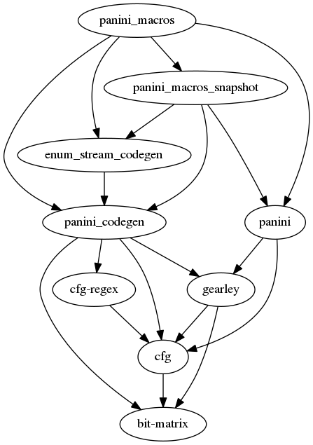

## Panini • 

A blazing fast, modern, extensible parser generator.

Work in progress.
A general-purpose parser generator as a Rust syntax extension.

On the surface, the goal of Panini is ease of use. In the future, it
will also offer advanced features without compromising on the speed.

Panini uses **[gearley](https://github.com/pczarn/gearley)** for Earley parsing,
which can handle all context-free grammars. If you write a grammar for a
language, it will work as expected.

### Motivation

Months of research on parsing algorithms led me to believe that the Earley/Marpa algorithm is the best parsing tool for many purposes. Earley's is simple, flexible and extensible. Alas, nobody made an advanced parser generator that would realize the full potential of the algorithm. Therefore I resolved to make one.

### Syntax and semantics of grammar description

User-friendliness is harder to achieve in a statically typed language such as Rust.
Consequently, Panini offers typed expressions and type inference. Expression
are typed according to intuitive rules:

| Expression    | Automatic type                     | Description                                              |
|---------------|------------------------------------|----------------------------------------------------------|
| `name`        | _type of name_                     | Use of a symbol.                                         |
| `()`          | **()**                             | A nulling expression.                                    |
| `(A)`         | _type of A_                        | Ignore redundant parentheses.                            |
| `(A B)`       | **(**_type of A_, _type of B_**)** | Group two or more expressions.                           |
| `item*`       | **Vec<**_type of item_**>**        | A sequence that repeats zero or more times.              |
| `item+`       | **Vec<**_type of item_**>**        | A sequence that repeats one or more times.               |
| `A | B`       | _type of A and B_                  | An alternative. All of its arms must have the same type. |

Automatic recursive types are forbidden.

Grammars that have mistakes in their semantics may cause warnings, but never critical errors,
during compilation. These warnings may indicate that some semantic actions are ignored.

### Dependency graph

The following libraries were created for Panini.

### Related work

#### In Rust

* [LALRPOP](https://github.com/nikomatsakis/lalrpop) — a LR(1) parser generator focused on ease of use.
* [rust-lang's GLL](https://github.com/rust-lang/gll/) — a parsing framework.
  * [grammer with an E](https://github.com/lykenware/grammer/) — a grammar framework.
* [Oak](https://github.com/ptal/oak/) — a PEG parser generator with typed expressions.

#### In other languages

* [Marpa](https://jeffreykegler.github.io/Marpa-web-site/) — an Earley parser (not a generator)
  that has advanced features. Written in literate C and in Perl.
* [YAEP](https://github.com/vnmakarov/yaep) — an Earley parser engine that currently has
  the best speed and small memory use. Written in C.

#### In academia

* OMeta — a PEG parser with advanced features that go beyond parsing.
* [SPPF-Style Parsing From Earley Recognisers](https://www.researchgate.net/publication/220367479_SPPF-Style_Parsing_From_Earley_Recognisers) — Elizabeth Scott.

### Quotes

> I'd be very happy to have a superfast general parser out there but some extremely bright minds have been unable to solve it for 40 years.

 — Terence Parr, author of ANTLR

### Thanks

Thanks to Jay Earley, Jeffrey Kegler, John Aycock, R. Nigel Horspool, and Elizabeth Scott who pioneered Earley parsing.

Special thanks to CD PROJEKT RED, HAEVN, Kaśka Sochacka, sanah, Kwiat Jabłoni, Carbon Based Lifeforms, and Solar Fields for providing amazing music, which made coding even more enjoyable.

### License

Dual-licensed for compatibility with the Rust project.

Licensed under the Apache License Version 2.0:
http://www.apache.org/licenses/LICENSE-2.0, or the MIT license:
http://opensource.org/licenses/MIT, at your option.
